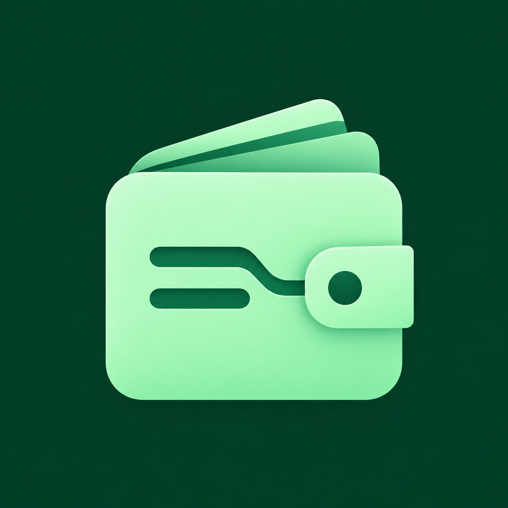

<p align="center">
  
</p>

<h1 align="center">Money Manager</h1>

<p align="center"><strong>Your money. One clear picture.</strong></p>

<p align="center">
A local-first expense and income tracker with clear insights, customizable categories,
and 12 theme collections. Previously called <strong>SpendMate</strong>.
</p>

<p align="center">
  <a href="https://play.google.com/store/apps/details?id=com.farhan10ansari.spendmate">Get it on Google Play</a>
  · <a href="https://github.com/farhan10ansari/SpendMate/issues">Report an issue</a>
  · <a href="https://farhan10ansari.github.io/SpendMate/privacy-policy">Privacy policy</a>
</p>

<p align="center">
  
  
  
  <a href="LICENSE"></a>
</p>

## Explore

- [Features](#features)
- [Themes and appearance](#themes-and-appearance)
- [Privacy and data](#privacy-and-data)
- [Development setup](#development-setup)
- [Checks and builds](#checks-and-builds)
- [Project structure](#project-structure)
- [Contributing and support](#contributing-and-support)

## Features

### 💸 Everyday tracking

- Add, view, edit, and delete expenses and income.
- Record categories or income sources, notes, dates, and times; add payment methods to expenses.
- Browse expenses grouped by day and income grouped by month.
- Create custom categories and sources with colors and icons.
- Choose a display currency and locale-aware number formatting, with currency-aware minimum amounts.
- Set a daily reminder to keep your records up to date.

### 📊 Clearer insights

- Review income, expenses, net income, and savings rate on the home screen.
- Explore daily averages, transaction counts, top categories/sources, and biggest/smallest entries.
- Visualize category breakdowns and switch between daily, weekly, monthly, yearly, and all-time views.
- See recent activity without leaving the dashboard.
- Use responsive phone/tablet layouts, animated home statistics, and optional haptic feedback.

### 🔐 Useful controls

- Protect app access with supported biometrics or device authentication.
- Export backups to a file and restore your records.
- Adjust preferences, revisit the guided tour, or reset app data from the menu.

## Themes and appearance

Open **Menu → Themes** to choose a collection and an appearance mode.

| Collection | Palette |
| --- | --- |
| Mint | Fresh green and warm gold; the original look |
| Ocean | Calm blue and coastal teal |
| Rose | Soft rose and mellow plum |
| Amber | Warm honey and terracotta |
| Violet | Rich purple and cool cyan |
| Slate | Quiet neutrals and muted bronze |
| Lava | Fiery orange and molten crimson |
| Monochrome | Black, white, and grayscale |
| Ubuntu | Ubuntu-inspired orange and aubergine |
| Dracula | Dracula-inspired purple and vivid pink |
| Nord | Nord-inspired frost blue and sage |
| Gruvbox | Gruvbox-inspired warm retro earth tones |

Every collection has **light and dark variants**. Choose **Light**, **Dark**, or
**System** independently of the collection. Both choices are saved locally and
restored when the app opens. The current-selection card shows your active choice.

For contributors, palettes live in separate files under
[`themes/collections/`](themes/collections), with a registry in
[`themes/collections/index.ts`](themes/collections/index.ts). Register new collections
there and keep both appearance variants consistent. Unknown collection IDs fall
back to Mint.

Android's wallpaper-tinted launcher icon is separate from these in-app themes;
it depends on the device launcher and system settings.

## Privacy and data

Financial records are stored locally using SQLite. Transactions are entered
manually: there is no bank connection or automatic transaction import. Selecting
a display currency does not convert existing amounts using exchange rates.

Backups are exported as JSON files. Treat them as sensitive personal information;
the app does not encrypt those export files. App lock controls access to the UI
and should not be confused with database encryption. Keep a backup before
uninstalling the app or resetting its data.

See the [privacy policy](https://farhan10ansari.github.io/SpendMate/privacy-policy)
for details.

## Development setup

### Requirements

- Bun **1.4.0**, matching `packageManager` and the EAS build profiles.
- A Node.js version supported by the installed Expo/React Native toolchain.
- Git.
- Android Studio, Android SDK, and a compatible JDK for local Android builds.
- macOS and Xcode for local iOS builds.

Use the project-local Expo CLI through `bunx expo`; a global legacy `expo-cli`
installation is not needed. Use a development build for this app's native modules,
not Expo Go as the primary testing environment.

```bash
git clone https://github.com/farhan10ansari/SpendMate.git
cd SpendMate
bun install --frozen-lockfile
```

### Environment

Create a `.env` file at the repository root. There is no checked-in `.env.example`.
These values supply app metadata and links, not secrets:

```dotenv
EXPO_PUBLIC_APP_AUTHOR="farhan10ansari"
EXPO_PUBLIC_CONTACT_EMAIL="spendmate.assist@gmail.com"
EXPO_PUBLIC_TELEGRAM_URL="https://t.me/farhan10ansari_spend_mate_disc"
EXPO_PUBLIC_PRIVACY_POLICY="https://farhan10ansari.github.io/SpendMate/privacy-policy"
EXPO_PUBLIC_LOG_LEVEL="error"
```

`EXPO_PUBLIC_FEEDBACK_FORM` optionally supplies a feedback-form URL. Public
environment variables are embedded in the client—never put credentials in them.
Cloud-build metadata is configured in [`eas.json`](eas.json); `.env` is excluded
from Git and EAS uploads. [`package.json`](package.json) is the single source of
truth for the user-facing app version. [`app.config.js`](app.config.js) supplies
that value to Expo, and the About page reads the resolved Expo configuration.

### Run locally

```bash
# Build and launch on an Android device/emulator
bun android

# Build and launch on iOS (macOS)
bun ios

# Start Metro for an already-installed development build
bunx expo start --dev-client
```

After changing the app name, icons, splash screen, or native plugin configuration,
refresh an existing native project before rebuilding:

```bash
bunx expo prebuild --platform android --no-install
bun android
```

Native folders are generated and ignored by Git. Review native customizations
before regenerating; `--clean` deletes and recreates the native project. Reloading
Metro alone does not update installed launcher icons or the app label.

## Checks and builds

### Local checks

```bash
bunx tsc --noEmit
bun run lint
bun test tests
bun run doctor
```

For intentional database schema changes, generate and review migrations with
`bun run db:migrate`. Theme selection uses the existing persisted preferences;
adding a palette does not require a database schema migration.

### EAS cloud builds

```bash
bunx eas-cli@latest login

# Development client
bunx eas-cli@latest build --platform android --profile development

# Installable preview APK
bunx eas-cli@latest build --platform android --profile preview

# Production AAB for Google Play
bunx eas-cli@latest build --platform android --profile production
```

The corresponding `bun run build:development`, `build:preview`, and
`build:production` scripts require `eas` on your PATH. The production profile uses
remote versioning and increments Android's version code automatically.

To prepare a release, update only the `version` field in `package.json`. The
user-facing Expo/Android/iOS version and About screen will use that value. EAS
continues to manage the platform build number/version code separately.

[`.easignore`](.easignore) excludes marketing artwork, backups, documentation,
tests, and local outputs from build uploads while retaining runtime assets and
migrations. EAS generates the native projects from the app configuration.

The Play Store title is **Money Manager: Expense Tracker**; the installed app
label is **Money manager**. The repository name, URL scheme, and Android package
ID (`com.farhan10ansari.spendmate`) retain their original identifiers.

### Store artwork

- [Play Store icon](marketing/play-store/exports/play-store-icon.png): 512 × 512.
- [Feature graphic](marketing/play-store/exports/feature-graphic.png): 1024 × 500.
- [Screenshot artwork and review notes](marketing/play-store/README.md).
- [Native icon specifications](assets/images/README.md).

The promotional screenshots are AI-composited drafts, not pixel-exact captures.
Review their documented UI differences before publishing. Store assets are
uploaded separately in Play Console, not bundled into the app.

## Project structure

| Location | Responsibility |
| --- | --- |
| `app/` | Expo Router pages and layouts |
| `features/`, `components/` | Feature UI and shared components |
| `themes/` | Theme collections, shared palette factory, and providers |
| `stores/`, `contexts/`, `hooks/` | Preferences, state, and reusable logic |
| `db/`, `drizzle/`, `repositories/` | SQLite access, migrations, and data queries |
| `assets/` | Runtime icons, fonts, and animations |
| `plugins/` | Local Expo configuration plugins |
| `tests/` | Bun regression tests |
| `marketing/play-store/` | Store artwork and generation notes |

Built with **Expo SDK 57**, **React Native**, **TypeScript**, **Expo Router**,
**SQLite + Drizzle**, **Zustand**, **TanStack Query**, **React Native Paper**,
**Reanimated**, and **React Native Gifted Charts**. Exact versions live in
[`package.json`](package.json) and [`bun.lock`](bun.lock).

## Contributing and support

Read the [contribution guide](CONTRIBUTING.md) and [project standards](AGENTS.md).
Use the Bun commands above, run the checks, and keep pull requests focused.
Please do not include personal transaction records or private backup files in
issues or screenshots.

- [Report bugs or suggest a feature](https://github.com/farhan10ansari/SpendMate/issues)
- [Telegram community](https://t.me/farhan10ansari_spend_mate_disc)
- [Email support](mailto:spendmate.assist@gmail.com)

Created by [Mohd Farhan Ansari](https://github.com/farhan10ansari).
If the app is useful to you, a star, a thoughtful review, or feedback is welcome.

## License

Licensed under the **Business Source License 1.1**. See [LICENSE](LICENSE) for
the full terms, usage restrictions, and scheduled change license.
